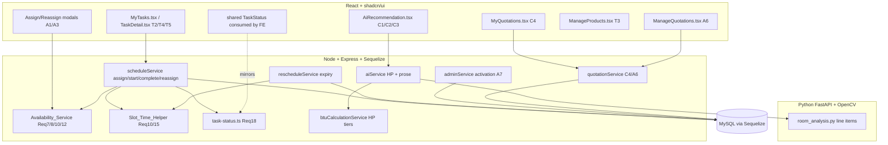

# Design Document — Revision Batch 1

## Overview

Revision Batch 1 delivers 17 stakeholder changes (Requirements 1–18, plus the two cross-cutting Requirements 19 and 20) across the Customer, Admin, and Technician roles of the DVTech AI-Powered Web System. The unifying theme is that several revisions share the same underlying logic, so the design centres on **three shared building blocks** and then layers each role-specific change on top of them:

1. **`Availability_Service`** — one function that answers "which technicians can take a task for this date + slot?", used by Assign (Req 7), Reassign (Req 8), reschedule technician earmarking (Req 10), and activation availability (Req 12). It refactors today's `getAvailableTechnicians` / `canAssignToSlot` pair in `backend/src/services/scheduleService.ts` into a single, pre-filterable service.
2. **`Slot_Time_Helper`** — one function returning the Asia/Manila start instant of a date + slot (Morning = 8:00 AM, Afternoon = 12:00 PM), used by reschedule expiry (Req 10) and the technician start-gate (Req 15).
3. **`Task_Status_Enum`** — one shared status vocabulary used by backend and frontend, extended with a new `reassigned` value, replacing the string literals scattered across `scheduleService.ts` and the frontend `types/index.ts` (Req 18).

The batch is grounded in the existing stack: Node.js + Express 5 + TypeScript with Sequelize (`sequelize-typescript`) models, a React + TypeScript + shadcn/ui frontend, and a Python/FastAPI/OpenCV microservice (`ai-service`). Where a revision fixes a bug, the design names the exact function and the exact defect. Where a revision adds a feature, it names the real file it plugs into.

Two revisions (C4 My Quotations, A6 Manage Quotations) depend on an external document, `INQUIRY.DOCX`, that was **not provided** in the workspace. Per Requirement 5, this design defines a clearly-marked **placeholder quotation status vocabulary** and isolates it behind a single constants module so it can be swapped when `INQUIRY.DOCX` arrives without touching feature logic.

### Requirement-to-change map

| Req | Change | Primary code touched |
|-----|--------|----------------------|
| 1 (C1) | Deterministic HP + permitted unit types | `btuCalculationService.ts`, `aiService.ts` |
| 2 (C2) | Scroll AI result into view | `frontend/.../customer/AiRecommendation.tsx` |
| 3 (C3) | Non-inflated OpenCV recommendations | `aiService.ts`, `imageService.ts`, `ai-service` |
| 4 (C4) | My Quotations tab | new `Quotation` model, customer pages/routes |
| 5 | INQUIRY.DOCX dependency | `quotationStatus` constants module |
| 6 (A1) | Assign modal prefill | Assign modal, `scheduleService.assignTechnician` |
| 7 (A2) | Reliable available-technician dropdown | `Availability_Service` |
| 8 (A3) | Reassign dropdown | `Availability_Service`, Reassign modal |
| 9 (A4) | Reassignment transfer + audit trail | `scheduleService.reassignTechnician`, new audit model |
| 10 (A5) | Reschedule expiry = earlier of +48h / slot start | `rescheduleService.ts`, `Slot_Time_Helper` |
| 11 (A6) | Manage Quotations tab | admin pages/routes, `Quotation` model |
| 12 (A7) | Reliable technician activation | `adminService.setAccountActive` |
| 13 (A8) | Remove `busy` availability state | `TechnicianDetail`, migration, admin UI |
| 14 (T1) | Remove technician Dashboard | `App.tsx`, `DashboardLayout`, technician pages |
| 15 (T2) | Block Start before assigned date/slot | `scheduleService.startTask`, `Slot_Time_Helper`, MyTasks |
| 16 (T3) | Continuous-scroll products catalog | `ManageProducts.tsx` |
| 17 (T4) | Reliable completion submission | `scheduleController.completeTaskHandler`, `scheduleService.completeTask` |
| 18 (T5) | Consistent In-Progress status | `Task_Status_Enum`, `scheduleService`, MyTasks/TaskDetail |
| 19 | Shared services + server enforcement | all of the above |
| 20 | Automated test coverage | Jest / Playwright / Postman / PBT |

## Architecture

The system keeps its existing three-tier shape. The batch adds shared modules in the backend service layer and a shared enum consumed by the frontend.



### Timezone strategy (Req 19.5, 6.7)

All half-day scheduling logic runs in **Asia/Manila** (UTC+8, no DST). Two distinct value kinds are handled differently:

- **Calendar dates** (`scheduledDate`, `proposedDate`, `serviceRequiredDate`) are stored as `DATEONLY` `YYYY-MM-DD` strings and represent a Manila calendar day. Because `DATEONLY` has no time component, a stored date already matches the displayed date as long as we never round-trip it through a UTC `Date` at midnight. `Slot_Time_Helper` is the only place that converts a date+slot into a real instant, and it does so by constructing the instant at the Manila offset (`+08:00`).
- **Client-submitted date/time** that arrives with a non-Manila offset or without offset information is normalized on the server before storage: the server extracts the Manila calendar date from the submitted instant and stores that `YYYY-MM-DD`. A small `manilaDateFromInput(value)` helper in the timezone utility does this so no controller re-implements it.

The Manila offset is centralized as `MANILA_UTC_OFFSET_MINUTES = 480` in a new `backend/src/utils/timezone.ts`, and `Slot_Time_Helper` lives there too so expiry and the start-gate share one implementation (Req 19.2).

## Components and Interfaces

### Shared building blocks

#### 1. `Availability_Service` (Req 7, 8, 10, 12, 19.1)

New module `backend/src/services/availabilityService.ts`. It consolidates the current `getAvailableTechnicians(date, slot)` and the availability portion of `canAssignToSlot`. The current defect behind A2 is that availability was partly read from `TechnicianDetail.availabilityStatus` (which `syncTechnicianAvailability` overwrites to `busy`), so technicians who were merely mid-task disappeared from the dropdown. The refactor computes conflicts purely from the `technician_schedule` table.

```ts
export interface AvailabilityQuery {
  date: string;                 // YYYY-MM-DD (Manila calendar day)
  slot: 'morning' | 'afternoon';
  excludeTechnicianId?: number; // pre-filter: removed before other checks (Req 7.7, 8.2)
}

export interface AvailableTechnician {
  id: number;
  name: string;
  email: string;
  contactNumber: string | null;
  availabilityStatus: 'available' | 'unavailable'; // 'busy' removed (Req 13)
  tasksOnDate: number;
}

// Returns the eligible technicians for a date + slot.
export async function getAvailableTechnicians(
  query: AvailabilityQuery
): Promise<AvailableTechnician[]>;

// Single-technician predicate reused by assign/reassign write paths.
export async function isTechnicianAvailable(
  technicianId: number,
  query: AvailabilityQuery,
  excludeScheduleId?: number
): Promise<{ ok: boolean; reason?: string }>;
```

Evaluation order (the pre-filter requirement of Req 7.7 is explicit):

1. **Pre-filter**: if `excludeTechnicianId` is set, drop that technician from the candidate set *before* anything else.
2. **Active-account filter**: keep only `User.role === 'technician'`, `isActive === true`, `deletedAt === null` (Req 7.1, 7.3, 12.2).
3. **Manual-unavailable filter**: drop technicians whose `TechnicianDetail.availabilityStatus === 'unavailable'` (Req 13.5).
4. **Schedule-conflict filter**: drop technicians holding a non-cancelled schedule (`status NOT IN ('rejected')`, and not soft-deleted) on the *exact* `date` + `slot` (Req 7.1, 7.4, 8.3). Different date or different slot is never a conflict.

`canAssignToSlot` in `scheduleService.ts` is reduced to delegating to `isTechnicianAvailable` plus the existing 2-tasks/day cap, so the assign and reassign write paths validate through the same code the dropdown reads.

#### 2. `Slot_Time_Helper` (Req 10, 15, 19.2)

Lives in `backend/src/utils/timezone.ts`.

```ts
export type TimeSlot = 'morning' | 'afternoon';

// Start instant of a Manila date + slot. Morning=08:00, Afternoon=12:00 (Req 15.1).
// Throws a typed validation error if date/slot cannot be resolved (Req 10.5).
export function slotStartInstant(date: string, slot: TimeSlot): Date;

// Manila calendar date (YYYY-MM-DD) from an arbitrary client instant (Req 19.5).
export function manilaDateFromInput(value: string | Date): string;
```

`slotStartInstant('2025-09-30', 'morning')` builds `new Date('2025-09-30T08:00:00+08:00')`. Reschedule expiry and the start-gate both call this, guaranteeing identical boundaries.

#### 3. `Task_Status_Enum` (Req 18)

New shared source of truth `backend/src/constants/taskStatus.ts`:

```ts
export const TASK_STATUS = {
  Assigned: 'assigned',
  Accepted: 'accepted',
  Rejected: 'rejected',
  Reassigned: 'reassigned',   // NEW (Req 9.1)
  InProgress: 'in-progress',
  Completed: 'completed',
} as const;
export type TaskStatus = (typeof TASK_STATUS)[keyof typeof TASK_STATUS];
export const STARTABLE_STATUSES: TaskStatus[] = [TASK_STATUS.Assigned, TASK_STATUS.Reassigned];
```

Backend services import `TASK_STATUS` instead of writing `'in-progress'` literals. The frontend gets a mirrored `frontend/src/constants/taskStatus.ts` with the identical string values (the two files are kept in lockstep; a unit test asserts they match). All frontend status comparisons and badge/progression logic read from it, eliminating the literal-string drift that lets Start set a value the completion check does not recognize (Req 18.3, 18.4).

### Customer components

#### C1 — Deterministic HP and permitted unit types (Req 1)

The current `deriveHpFromBtu` in `btuCalculationService.ts` snaps to a hardcoded `STANDARD_HP_SIZES` array using a `2400 BTU/HP` divisor. This is replaced with a **table-driven** derivation that reads HP tiers and rated BTU from the `aircon_products` table (Req 1.3, 1.4):

```ts
export interface HpTier { horsepower: number; ratedBtu: number; }

export interface HpDerivation {
  kind: 'matched' | 'exceeds-largest' | 'no-tier' | 'no-catalog';
  recommendedHp: number | null;
  // the product row backing the recommended tier / the largest tier for exceeds-largest
  tierProductId: number | null;
}

// Smallest tier whose ratedBtu >= load; tie-break lowest HP (Req 1.3).
export function deriveHpFromTiers(loadBtu: number, tiers: HpTier[]): HpDerivation;
```

Behaviour:

- Build `tiers` from active products (`horsepower`, `btuCapacity`), restricted to permitted types Window Type / Split Type (Req 1.1). Floor-Standing products never form a tier (Req 1.9).
- Pick the smallest `ratedBtu >= loadBtu`; on ties pick the lowest `horsepower` (Req 1.3).
- `loadBtu` exceeds the largest tier → `kind = 'exceeds-largest'`, and the response carries the largest tier's unit card plus a site-survey-or-multiple-units message (Req 1.9).
- No tier qualifies but tiers exist → `kind = 'no-tier'`, message "no matching unit", no HP/card (Req 1.13).
- No tiers at all → `kind = 'no-catalog'`, "recommendations unavailable", customer's room data preserved (Req 1.14).

Unit-type normalization and the LLM guardrail run in `aiService.generateRecommendation`:

- A `sanitizeUnitType(type)` maps any model/DB type to `'Window Type' | 'Split Type'`; anything else (including floor-standing) is coerced to `'Split Type'` (Req 1.1).
- A `stripFloorTerm(text)` removes the case-insensitive substring "floor" wherever it appears in reasoning, tips, unit-type rationale, and the prompt (Req 1.2). It also drops "floor-standing" from the model's allowed `unit_type` list so the advisory prompt cannot request it.
- The advisory prompt already receives the computed HP and unit type as fixed inputs; the design tightens this so that after the LLM returns, `recommendedHp` and `unitType` are **overwritten** with the computed values, and any HP number appearing in reasoning/tips that differs from the computed HP is replaced (Req 1.5, 1.6, 1.7).
- Electrical/breaker tips are selected by the computed HP class, not by the LLM's opinion (Req 1.8), by keying a `TIPS_BY_HP_CLASS` table off `recommendedHp`.
- Unit cards populate HP, BTU, inverter/non-inverter, and price straight from the matched `aircon_products` row (Req 1.10).

Worked checks: a 9,690 BTU load resolves to the smallest tier ≥ 9,690 (1.5 HP in seeded data) → Req 1.11; 14,475 BTU resolves to 2.0 HP Split Type → Req 1.12.

#### C2 — Bring the AI result into view (Req 2)

Frontend-only, in `AiRecommendation.tsx`. There is no current scroll/focus behaviour (grep found none), so this is additive.

- A `resultRef` on the result container heading. When a *new* result transitions from loading→loaded, a `useEffect` keyed on the recommendation id scrolls `resultRef` into view and moves focus to the heading with `heading.focus({ preventScroll: true })` (Req 2.1, 2.5, 2.6).
- `prefers-reduced-motion` is read via `window.matchMedia`; when set, `scrollIntoView({ behavior: 'auto' })`, otherwise `'smooth'` (Req 2.4).
- An `IntersectionObserver` on `resultRef` toggles a floating "Result ready" button; visible only while the result top is out of viewport, clicking it scrolls to the result (Req 2.2, 2.3).
- The submit button shows a loading state and is disabled while a request is in flight; concurrent submissions are rejected (Req 2.7).
- On request failure the scroll effect does not run, leaving scroll position unchanged (Req 2.8).

#### C3 — Consistent, non-inflated OpenCV recommendations (Req 3)

The current code funnels image hints through `deriveApplianceCounts`, which can double-count and has no uplift ceiling. The redesign makes the OpenCV contribution an explicit, capped, line-itemized adjustment on top of `Base_Load`:

```ts
export interface UpliftInput {
  baseLoadBtu: number;               // BTU from form inputs only
  formHeatSources: string[];         // heat sources the customer declared
  image?: {                          // absent when service unavailable (Req 3.11)
    windowCount: number;
    insulationQuality: 'poor' | 'fair' | 'good';
    heatSources: string[];
  };
  capFraction?: number;              // default 0.15 (Req 3.4), configurable via env
}

export interface UpliftResult {
  lineItems: { label: string; btu: number }[]; // each adjustment labeled (Req 3.1)
  cappedUpliftBtu: number;
  totalBtu: number;                             // baseLoad + cappedUpliftBtu
  narrativeFacts: { windows: number; poorInsulation: boolean; heatSources: string[] };
}

export function computeOpenCvUplift(input: UpliftInput): UpliftResult;
```

Rules:

- Each contribution (base line items from `computeBtu`, plus each image-derived adjustment) is a separate labeled line item (Req 3.1); the sum of displayed line items equals the displayed total within ±1 BTU (Req 3.2), guaranteed by deriving the total *as* the sum of the line items rather than computing it independently.
- Heat sources present in both the form and the image are unioned into a set keyed by normalized label, so each counts once (Req 3.3).
- The combined uplift is clamped to `capFraction * baseLoadBtu` (default 15%), read from `OPENCV_UPLIFT_CAP_FRACTION` env (Req 3.4, Q9). Because the with/without-photo totals differ only by the capped uplift, they can differ by at most the cap (Req 3.8).
- `narrativeFacts` is built from measured values only; the advisory prompt is given only these facts (Req 3.5). If `windowCount === 0`, no multi-window claim is passed (Req 3.6); if insulation is not `poor`, no poor-insulation claim is passed (Req 3.7).
- The C1 HP derivation and permitted-type rules run on this path unchanged (Req 3.9); 14,475 BTU with image metrics → 2.0 HP Split Type (Req 3.10).
- When `analyzeRoomImage` throws or returns nothing usable, the recommendation is produced from form inputs only, `cappedUpliftBtu = 0`, and the response carries `photoAnalysisApplied: false` so the UI can indicate photo analysis was skipped (Req 3.11). The existing `analyzeRoomImage` is wrapped so a microservice/LLM failure degrades gracefully instead of failing the whole request.

The Python `ai-service` `analyze_room` already returns per-metric fields; C3 exposes them as line items rather than folding them into an opaque appliance count.

#### C4 — My Quotations tab (Req 4)

New customer page `frontend/src/pages/customer/MyQuotations.tsx` and route `/my-quotations` under `CustomerLayout`, plus a nav item. Backed by a new `Quotation` model and `quotationService`.

```ts
// GET /api/quotations/mine — customer-scoped (Req 4.7, 4.8)
export async function listMyQuotations(userId: number): Promise<QuotationListItem[]>;
```

- Server filters strictly by `userId` from the JWT; ownership is enforced in the service and the route uses `roleMiddleware('customer')` (Req 4.7, 4.8).
- Each row: quotation identifier, unit brand + model, submitted date, current status, details action (Req 4.3), ordered most-recent-first (Req 4.4).
- Client search + status filter controls; empty state when nothing matches (Req 4.5, 4.6).
- Quotations remain visible at Assigned/Paid and the existing My Requests behaviour is preserved (Req 4.9).
- Status values come from the placeholder vocabulary (Req 4.10 / Req 5, see Data Models).

### Admin components

#### A1 — Assign modal prefill (Req 6)

The Assign modal (inside `ManageSchedules.tsx` / `ManageRequests.tsx`) prefills scheduled date and slot from the request's `serviceRequiredDate` / `serviceRequiredTime` when present, keeps them editable, and loads the technician dropdown via `Availability_Service` for those values (Req 6.1–6.4). On save, `scheduleService.assignTechnician` stores exactly the date+slot the dropdown was filtered on (Req 6.6); if the request has no requested date/slot the fields are empty and editable (Req 6.5). The stored date is the Manila calendar date via `manilaDateFromInput` (Req 6.7).

#### A2/A3 — Assign & Reassign dropdowns (Req 7, 8)

Both modals call `GET /api/schedules/available-technicians?date=&slot=` (Assign) and a reassign variant that passes `excludeTechnicianId` = current technician (Req 8.2). The endpoint delegates to `Availability_Service`. UI states: error state with retry on request failure (Req 7.5, 8.4); a distinct no-technicians message on empty success (Req 7.6, 8.5); Reassign action disabled until a technician is selected (Req 8.6, 8.7).

#### A4 — Reassignment transfer + audit trail (Req 9)

`scheduleService.reassignTechnician` is rewritten. Today it sets status back to `'assigned'` and writes no audit record. New behaviour:

```ts
export async function reassignTechnician(
  scheduleId: number,
  newTechnicianId: number,
  actingAdminId: number
): Promise<TechnicianSchedule>;
```

- Reject when current status is `in-progress` or `completed` (Req 9.7).
- Server-validate the new technician is Active with no conflict for the schedule's date+slot via `isTechnicianAvailable` (Req 9.6).
- In a single `sequelize.transaction`: set `status = 'reassigned'`, set `technicianId = newTechnicianId`, and insert a `ScheduleReassignment` audit row (previous technician, new technician, acting admin, timestamp) — all-or-nothing (Req 9.1, 9.4, 9.5).
- The transfer makes the schedule appear in the new technician's My_Tasks and disappear from the previous technician's list and counts, which is automatic because `listSchedules` filters by `technicianId` (Req 9.2, 9.3).
- A `reassigned` task is startable by the new technician under the Assigned checks plus a re-check that the new technician is still Active at start time (Req 9.8) — handled in the start-gate below.

#### A5 — Reschedule expiry (Req 10)

`rescheduleService.proposeReschedule` currently sets `rescheduleExpiresAt = now + 48h`. New:

```ts
export function computeRescheduleExpiry(
  createdAt: Date, proposedDate: string, proposedSlot: TimeSlot
): Date; // earlier of createdAt+48h and slotStartInstant(...) (Req 10.1, 10.2)
```

- Uses `Slot_Time_Helper` for the slot start (Req 10.3); one shared function (Req 10.4).
- If the slot can't be resolved, reject the proposal with a validation error naming the field and do not create it (Req 10.5).
- **Auto-expiry approach — lazy check retained and tightened.** The current `expireStaleReschedules` runs on every read path, which fits the Vercel serverless deployment (no always-on worker). We keep it because a background cron is not reliably available serverless, but we make expiry idempotent: the update only matches rows still `needs-rescheduling` past expiry, so re-running leaves already-expired rows unchanged (Req 10.7). To meet the "within 60 seconds" bound (Req 10.6) without a guaranteed inbound read, we add a lightweight scheduled trigger (Vercel Cron hitting an internal `POST /api/internal/expire-reschedules`, or `setInterval` in the non-serverless `app.ts` path) that calls `expireStaleReschedules` every 30 seconds. Justification: the lazy check guarantees correctness on read; the timer guarantees the visibility bound. Both call the same idempotent function.
- Expired proposals let the customer submit a new request (Req 10.8, already supported by the `expired` status).
- Expiry is displayed to admin and customer as a Manila date-and-time (Req 10.9).
- Worked checks: created 2025-09-29 09:00 Manila for 2025-09-30 Morning → 2025-09-30 08:00 (slot start is earlier) (Req 10.10); created 2025-09-29 09:00 for five days later → 2025-10-01 09:00 (created+48h is earlier) (Req 10.11).

#### A6 — Manage Quotations tab (Req 11)

New admin page `ManageQuotations.tsx`, route `/admin/quotations`, nav item. Lists all quotation requests with identifier, customer, unit, submitted date, status, and admin actions from the placeholder vocabulary (Req 11.2), most-recent-first (Req 11.3), with search + status filter (Req 11.4). A quotation-based request enters the "Requests Awaiting Scheduling" list only at Paid status (Req 11.5, 11.6, Q2); non-quotation requests keep current scheduling behaviour (Req 11.7). Non-admins are denied server-side via `roleMiddleware('admin')` (Req 11.8).

#### A7 — Reliable technician activation (Req 12)

Activation flows through `adminService.setAccountActive(id, 'technician', true)`. The A7 defect: when activating, the code recomputes availability, but the not-found / already-active / forbidden cases were not distinctly reported, and an unexpected error was not logged with a stack trace. The redesign gives activation explicit responses:

- Target account missing → 404 (Req 12.4). `findAccount` already throws 404; we ensure activation uses it before any state change.
- Already Active → 409 conflict (Req 12.5) — a new guard, since today re-activating an active account silently succeeds.
- Requester not authorized → 403 (Req 12.6), enforced by `roleMiddleware('admin')` plus a service-level actor check.
- On success: clear deactivated + archived state, set Active, recompute availability so the technician reappears in `Availability_Service` results and can log in (Req 12.1, 12.2, 12.3).
- Any unexpected error is logged with its stack trace in the error middleware/service catch (Req 12.7).
- Deactivate→activate cycles succeed repeatedly (Req 12.8).

#### A8 — Remove the `busy` availability state (Req 13)

- `TechnicianDetail.availabilityStatus` ENUM becomes `('available','unavailable')`; the model, `UpdateTechnicianInput`, API responses, and UI drop `busy` (Req 13.1).
- A **mandatory** data migration converts every existing `busy` row to `available` before altering the ENUM (Req 13.2). This is a required step, not optional, because leftover `busy` rows would violate the new ENUM.
- `syncTechnicianAvailability` stops writing `busy`; it only ever manages the manual `available`/`unavailable` toggle and the deactivation→`unavailable` rule. Job eligibility is computed from the schedules table via `Availability_Service` (Req 13.3, 13.5).
- `getDashboardStats` continues counting `available` (still valid). The manual Available/Unavailable toggle is retained (Req 13.4, Q4). All other technician-table columns/actions are unchanged (Req 13.6).

### Technician components

#### T1 — Remove technician Dashboard (Req 14)

- Remove the `/technician` route and `TechnicianDashboard` import from `App.tsx`; make `/technician/tasks` (My Tasks) the technician landing page and redirect `/technician` → `/technician/tasks` (Req 14.2, 14.3).
- Remove the Dashboard nav item and top-bar link in `DashboardLayout`; label the technician entry "My Tasks" (Req 14.1, 14.4).
- Delete `TechnicianDashboard.tsx` and any endpoint used only by it (Req 14.5). (Dashboard stats endpoint stays if shared with admin; verified during implementation.)

#### T2 — Block Start before assigned date/slot (Req 15)

`scheduleService.startTask` currently gates only on `status === 'assigned'`. New gate:

- Allowed statuses: `assigned` and `reassigned` (Req 15.6, via `STARTABLE_STATUSES`).
- Compute `startAt = slotStartInstant(schedule.scheduledDate, schedule.scheduledTime)`; if Manila-now `< startAt`, reject with a 400 client error (Req 15.5). Uses the shared `Slot_Time_Helper` (Req 15.7).
- For a `reassigned` task, additionally re-check the technician is still Active before starting (Req 9.8).
- MyTasks disables the Start control while now `< startAt` and shows the becomes-startable date/time; enables it at/after `startAt` (Req 15.2, 15.3, 15.4). The frontend uses the same Manila boundary returned by the API (the API returns `startableAt` on each task).

#### T3 — Continuous-scroll products catalog (Req 16)

`ManageProducts.tsx` (grep found no existing pagination, so the table may already be list-style; the design formalizes it). Present all products in one scrolling list, remove any Previous/Next controls, replace page-of-pages text with a total count reflecting the active search/filter, and apply text search + Type filter + column sort across all rows (Req 16.1–16.4). For large catalogs the list uses windowing (e.g. `@tanstack/react-virtual`) to keep rendering cheap while remaining a single continuous scroll; noted as an implementation option, not a behavioural change. Other tables using Previous/Next are untouched (Req 16.5, Q5).

#### T4 — Reliable completion submission (Req 17)

The completion path spans `scheduleController.completeTaskHandler` (multipart via `multer`) and `scheduleService.completeTask`. Current gaps: photo size/type are validated only loosely, error responses aren't differentiated, and completion isn't a transaction. Redesign:

- Multipart handling: `multer` memory storage; the controller saves the photo only after validation passes.
- Validation order and specific responses:
  - Missing required field (report or photo) → 400 naming the field (Req 17.3).
  - Report length outside 20–2000 → 400 naming `report` (Req 17.4).
  - Photo > 5 MB → 413 payload-too-large (Req 17.6). (The multer limit is set to 5 MB for this route so oversized uploads are caught as 413, not the generic 10 MB image limit.)
  - Photo type not JPEG/PNG/WEBP → 415 unsupported-media-type (Req 17.7).
  - Task status not `in-progress` → 409 naming the current status (Req 17.5).
  - Unexpected fault → roll back, leave status unchanged, 500, log stack trace (Req 17.9).
- On success, in one transaction: store report text, photo path, set status `completed`, set `completedAt`; all-or-nothing (Req 17.1, 17.8). The task moves In-Progress→Completed tab, counts update, and admin/customer views reflect Completed (Req 17.2).
- The completion modal displays the specific server error message within 2 seconds (Req 17.10).

#### T5 — Consistent In-Progress status (Req 18)

Start persists `TASK_STATUS.InProgress` on the same row the completion check reads (Req 18.1). The completion check compares against `TASK_STATUS.InProgress` from the shared enum (Req 18.3, 18.6). Frontend badge, progression indicator, and tab counts update from the server response and reflect the stored status after reload (Req 18.2, 18.5, 18.7). Backend and frontend share one `Task_Status_Enum` (Req 18.4).

## Data Models

New and changed models, each with a Sequelize migration. New migrations are numbered from `20240101000042` upward (the latest existing is `...041`).

### Changed: `TechnicianSchedule.status` — add `reassigned` (Req 9.1, migration `042`)

```
ALTER ENUM status: ('assigned','accepted','rejected','reassigned','in-progress','completed')
```

Model `TechnicianSchedule.ts` ENUM and the `status` union type are extended; the frontend `ScheduleStatus` type gains `'reassigned'`.

### Changed: `TechnicianDetail.availabilityStatus` — remove `busy` (Req 13, migration `043`)

Two-step, mandatory:
1. `UPDATE technician_details SET availability_status='available' WHERE availability_status='busy';` (Req 13.2)
2. `ALTER ENUM availability_status: ('available','unavailable')`

### New: `schedule_reassignments` audit table (Req 9.5, migration `044`)

| Column | Type | Notes |
|--------|------|-------|
| id | INT PK auto | |
| schedule_id | INT FK → technician_schedule | the reassigned schedule |
| previous_technician_id | INT FK → users | who it moved from (Req 9.5) |
| new_technician_id | INT FK → users | who it moved to (Req 9.5) |
| reassigned_by | INT FK → users | acting admin (Req 9.5) |
| reassigned_at | DATETIME | reassignment timestamp (Req 9.5) |
| created_at / updated_at | DATETIME | |

New model `ScheduleReassignment.ts`, registered in `models/index.ts`, associated `belongsTo` schedule + the three users. Written inside the reassignment transaction (Req 9.4).

### New: `quotations` table (Req 4, 11; placeholder per Req 5, migration `045`)

There is no quotation entity today ("Request Quotation" deep-links into the service-request form). This model backs My Quotations and Manage Quotations.

| Column | Type | Notes |
|--------|------|-------|
| id | INT PK auto | quotation identifier (Req 4.3, 11.2) |
| user_id | INT FK → users | owner; drives customer scoping (Req 4.7, 4.8) |
| brand | STRING | unit brand (Req 4.3, 11.2) |
| model | STRING | unit model (Req 4.3, 11.2) |
| details | TEXT nullable | free-form request detail |
| status | ENUM (placeholder) | see below (Req 4.10, 5.2) |
| service_request_id | INT FK nullable | links to the scheduling request once Paid (Req 11.5) |
| submitted_at | DATETIME | ordering key (Req 4.4, 11.3) |
| created_at / updated_at / deleted_at | DATETIME | paranoid for archive parity |

**Placeholder status vocabulary (ASSUMPTION — pending `INQUIRY.DOCX`, Req 5.2, Q10).** Defined in one module `backend/src/constants/quotationStatus.ts` (mirrored on the frontend) so it can be replaced wholesale when `INQUIRY.DOCX` arrives:

```ts
// PLACEHOLDER — replace with INQUIRY.DOCX vocabulary when provided (Req 5).
export const QUOTATION_STATUS = {
  Submitted: 'submitted',
  UnderReview: 'under-review',
  Quoted: 'quoted',
  Assigned: 'assigned',
  Paid: 'paid',
  Declined: 'declined',
} as const;
// Assumed transitions: Submitted → UnderReview → Quoted → Assigned → Paid; any → Declined.
// Awaiting-Scheduling entry gate is exactly `Paid` (Req 11.5, 11.6, Q2).
```

This is explicitly marked as an assumption in the code comment and in the Assumptions section of requirements. Because every consumer reads the constant (never a literal), swapping the vocabulary is a one-file change plus a migration to remap the ENUM.

### Changed: `service_requests` — reschedule expiry field (Req 10, migration `046`)

`rescheduleExpiresAt` already exists as a `DATE` column. The change is semantic (its value is now `computeRescheduleExpiry(...)` rather than always +48h); no schema change is strictly required. If a distinct display of the two candidate instants is desired, an optional nullable `reschedule_window_ends_at` may be added, but the single `rescheduleExpiresAt` holding the earlier instant is sufficient and is the chosen approach. (Migration `046` reserved only if the optional column is adopted.)

## Correctness Properties

*A property is a characteristic or behavior that should hold true across all valid executions of a system — essentially, a formal statement about what the system should do. Properties serve as the bridge between human-readable specifications and machine-verifiable correctness guarantees.*

The properties below were derived from the acceptance-criteria prework and consolidated to remove redundancy (e.g. the many availability sub-criteria collapse into one availability property; the two expiry criteria into one `min` property). Each targets a pure or transaction-scoped function so it can be exercised with generated inputs.

### Property 1: Deterministic HP derivation from catalog tiers

*For any* BTU load and any set of HP tiers built from Window/Split products, `deriveHpFromTiers` selects a tier whose rated BTU is greater than or equal to the load, no tier with a smaller qualifying rated BTU exists, and among tiers sharing the smallest qualifying rated BTU the chosen one has the lowest horsepower; and when the load exceeds every tier the result is `exceeds-largest` with the largest tier, when no tier qualifies the result is `no-tier` with no HP, and when there are no tiers the result is `no-catalog`.

**Validates: Requirements 1.3, 1.4, 1.9, 1.11, 1.12, 1.13, 1.14, 3.9, 3.10**

### Property 2: Permitted unit types only

*For any* unit-type string from a product row or a language-model response, `sanitizeUnitType` returns exactly one of "Window Type" or "Split Type".

**Validates: Requirements 1.1**

### Property 3: The term "floor" is excluded from output

*For any* string, `stripFloorTerm` returns a string containing no case-insensitive occurrence of the substring "floor".

**Validates: Requirements 1.2**

### Property 4: HP and unit type are reconciled to the computed values everywhere

*For any* computed horsepower and unit type and any language-model advisory output, the returned recommendation reports the computed horsepower and unit type in the reasoning, the electrical tips, the breaker tips, and the unit cards, replacing any differing model-supplied value.

**Validates: Requirements 1.5, 1.6, 1.7, 1.8**

### Property 5: Line items sum to the total

*For any* base load and image metrics, every load contribution (base and image-derived) appears as a separate labeled line item and the sum of the line-item BTU values equals the reported total BTU within plus or minus 1 BTU.

**Validates: Requirements 3.1, 3.2**

### Property 6: Heat sources are counted once

*For any* set of form-declared heat sources and any set of image-detected heat sources, a heat source present in both contributes to the total exactly once.

**Validates: Requirements 3.3**

### Property 7: OpenCV uplift is capped

*For any* base load, image metrics, and configured cap fraction, the combined OpenCV uplift is no greater than the cap fraction times the base load, and consequently the totals produced with and without a room photo for the same room inputs differ by no more than that cap.

**Validates: Requirements 3.4, 3.8**

### Property 8: Narrative facts match measurements

*For any* image metrics, the narrative facts assert multiple windows only when the measured window count is greater than one and assert poor insulation only when the measured insulation quality is poor, and contain no claim not backed by a measured value.

**Validates: Requirements 3.5, 3.6, 3.7**

### Property 9: Graceful degradation without image analysis

*For any* room inputs, when image analysis is unavailable the recommendation is produced from the form inputs only, the OpenCV uplift is zero, and the response indicates that photo-based analysis was not applied.

**Validates: Requirements 3.11**

### Property 10: Availability computation with pre-filter exclusion

*For any* set of technicians (with varied active, archived, and manual-availability states) and any set of schedules, and for any date, slot, and optional excluded technician identifier, the availability result contains exactly the technicians who are not the excluded technician, whose account is active and not archived, whose manual availability is not Unavailable, and who hold no non-cancelled schedule on that exact date and slot; a schedule on a different date or a different slot is never treated as a conflict, and the excluded technician is absent regardless of their other state.

**Validates: Requirements 7.1, 7.3, 7.4, 7.7, 8.2, 8.3, 9.6, 13.3, 13.5**

### Property 11: Reschedule expiry is the earlier of two instants

*For any* creation time, proposed date, and proposed slot, the computed reschedule expiry equals the earlier of the creation time plus 48 hours and the Manila start instant of the proposed date and slot (and equals that shared instant when they coincide).

**Validates: Requirements 10.1, 10.2, 10.3, 10.10, 10.11, 15.1**

### Property 12: Expiry transition is idempotent

*For any* reschedule proposal, applying the expiry transition more than once leaves the proposal's status and expiry time unchanged after the first application.

**Validates: Requirements 10.7**

### Property 13: Reassignment is atomic and audited

*For any* reassignable schedule (status not In-Progress or Completed) and any eligible new technician, a confirmed reassignment either persists all of the new status Reassigned, the new technician, and an audit row recording the previous technician, the new technician, the acting admin, and the timestamp, or, if the operation faults, persists none of them and leaves the schedule unchanged.

**Validates: Requirements 9.1, 9.4, 9.5, 9.6**

### Property 14: Reassignment rejected for started or finished tasks

*For any* schedule whose status is In-Progress or Completed, a reassignment request is rejected and the schedule is left unchanged.

**Validates: Requirements 9.7**

### Property 15: Start is gated by the slot start instant

*For any* task whose status is Assigned or Reassigned and any current time, the start request succeeds if and only if the current Manila time is at or after the Manila start instant of the task's date and slot, and a Reassigned task additionally requires the new technician to still be active.

**Validates: Requirements 15.1, 15.5, 15.6, 15.7, 9.8**

### Property 16: Completion report length validation

*For any* report string, a completion request is accepted on the report-length rule if and only if the trimmed report length is between 20 and 2000 characters inclusive; otherwise it is rejected and the task status is left unchanged.

**Validates: Requirements 17.4**

### Property 17: Completion is atomic

*For any* accepted completion of an In-Progress task, the report text, the photo path, the Completed status, and the completion timestamp are all persisted together, and if the operation faults none of them are persisted and the status remains In-Progress.

**Validates: Requirements 17.1, 17.8, 17.9**

### Property 18: Start sets a consistent In-Progress status

*For any* task that a technician starts, the status the completion check subsequently reads is In-Progress, evaluated through the shared Task_Status_Enum, so a just-started task is never rejected on status grounds when completed.

**Validates: Requirements 18.1, 18.3, 18.6**

### Property 19: Quotation ownership is enforced

*For any* database of quotations spanning multiple customers and any requesting customer, the My Quotations result contains only quotations whose owner is the requesting customer.

**Validates: Requirements 4.2, 4.7, 4.8**

### Property 20: Quotation lists are ordered most-recent-first

*For any* set of quotations, the My Quotations and Manage Quotations lists are ordered by submitted date descending.

**Validates: Requirements 4.4, 11.3**

### Property 21: Awaiting-Scheduling membership gated on Paid

*For any* quotation-based request, it appears in the Requests Awaiting Scheduling list if and only if its status is Paid.

**Validates: Requirements 11.5, 11.6**

### Property 22: Activation round-trip and idempotence

*For any* technician account and any sequence of deactivate/activate operations, each operation completes successfully, and after an activation the account is Active with deactivated and archived state cleared and the technician appears in the Availability results for a free date and slot.

**Validates: Requirements 12.1, 12.2, 12.8**

### Property 23: Manila date normalization round-trip

*For any* client-submitted date or datetime with any timezone offset or none, `manilaDateFromInput` yields the Manila calendar date of that instant, and storing then displaying that date preserves it.

**Validates: Requirements 6.7, 19.5**

## Error Handling

Errors follow the existing convention: services throw an `Error` augmented with `statusCode` (and an optional `errors: ValidationError[]`), and the Express error middleware maps it to a JSON response `{ message, errors? }`. This batch adds the following specific behaviours.

### Recommendation (C1/C3)
- No HP tier qualifies → 200 with a "no matching unit" message and no HP/card (Req 1.13); no tiers at all → 200 with "recommendations unavailable" and the submitted room data preserved (Req 1.14). These are business outcomes, not faults.
- Image analysis failure (microservice down, LLM error, bad JSON) is caught inside the recommendation path and degrades to form-only with `photoAnalysisApplied: false` (Req 3.11); it does not surface as a 5xx.

### Availability / Assign / Reassign (A2/A3/A4)
- `available-technicians` request failure → the modal shows an error state with a retry action (Req 7.5, 8.4); empty success → a distinct no-technicians message (Req 7.6, 8.5).
- Reassignment of an In-Progress/Completed task → 409 (Req 9.7); new technician not active or conflicting → 409 from `isTechnicianAvailable` (Req 9.6). The transaction rolls back on any fault so no partial reassignment or orphan audit row is left (Req 9.4).

### Reschedule (A5)
- Unresolvable proposed date/slot → 400 validation error naming the field; the proposal is not created (Req 10.5).

### Activation (A7)
- 404 account not found (Req 12.4); 409 already active (Req 12.5); 403 unauthorized (Req 12.6); unexpected error logged with stack trace before the 500 response (Req 12.7).

### Completion (T4)
- 400 missing field naming it (Req 17.3); 400 report length out of range naming `report` (Req 17.4); 409 status not In-Progress naming the current status (Req 17.5); 413 photo over 5 MB (Req 17.6); 415 unsupported photo type (Req 17.7); 500 with rollback and logged stack trace on unexpected fault (Req 17.9). The completion modal renders the specific message within 2 seconds (Req 17.10).

### Start-gate (T2)
- Start before the slot start instant → 400 client error (Req 15.5); the UI also disables the control and shows the becomes-startable time, but the server rejection is authoritative (Req 19.4).

### Server-side enforcement (Req 19.4)
Every rule above is enforced in the service/controller layer even when the UI also guards it, so a crafted request cannot bypass a UI-only check. Quotation ownership (Req 4.8) and Manage Quotations access (Req 11.8) are enforced with `roleMiddleware` plus service-level `userId` scoping.

## Testing Strategy

Testing uses the existing tools plus a property-testing library: **Jest** (backend unit + property), **Playwright** (frontend E2E), and **Postman** (API contract). Requirement 20 requires the suite to run to a pass/fail result.

### Property-based testing

PBT is appropriate here because the batch centres on pure, input-varying functions (HP derivation, uplift/cap math, availability set computation, expiry `min`, date normalization, validation predicates) and transaction-scoped invariants that can be exercised with generated inputs against an in-memory SQLite database (already used for tests, per `backend/database.sqlite`).

- Library: **`fast-check`** with Jest (add `fast-check` as a backend dev dependency; it is not yet installed). Do not hand-roll property testing.
- Each of the 23 correctness properties is implemented as a **single** property-based test running a **minimum of 100 iterations**.
- Each test is tagged with a comment referencing its design property, format:
  `// Feature: revision-batch-1, Property {number}: {property_text}`
- Database-backed properties (10, 13, 14, 17, 18, 19, 21, 22) run against the in-memory SQLite Sequelize instance with a fresh sync per iteration or per case; atomicity properties (13, 17) inject a fault (e.g. a stubbed model method that throws mid-transaction) to assert rollback leaves no partial state.
- Pure-function properties (1–9, 11, 12, 15, 16, 20, 23) run without I/O.

### Unit tests (Jest, example + edge cases)

Complement the properties with concrete cases that property generators should also cover but which are worth pinning explicitly:
- HP boundaries: exactly 9,690 → 1.5 HP (Req 1.11) and 14,475 → 2.0 HP (Req 1.12, 3.10).
- Expiry worked examples: Req 10.10 and 10.11.
- Completion edge responses: 413 (Req 17.6), 415 (Req 17.7), 409 not-in-progress (Req 17.5), missing field (Req 17.3).
- Activation edges: 404 / 409 / 403 (Req 12.4–12.6).
- Reschedule unresolvable slot → 400 (Req 10.5).
- The migration converting `busy` → `available` leaves zero `busy` rows (Req 13.2).
- Frontend/backend `Task_Status_Enum` value parity (Req 18.4) and quotation-status constant parity (Req 5).

### Integration / API tests (Postman)

- `GET /api/schedules/available-technicians` returns active, conflict-free technicians and honours the reassign exclude (Req 7, 8).
- Reassignment endpoint transfers the schedule and writes an audit row (Req 9).
- Quotation endpoints enforce ownership (customer) and admin-only access (Req 4.8, 11.8).
- Awaiting-Scheduling list includes a quotation-based request only at Paid (Req 11.5, 11.6).

### E2E tests (Playwright)

Cover the UI behaviours that are not computable properties:
- C2 scroll-into-view, "Result ready" hint visibility, reduced-motion path, `preventScroll` focus, loading/disabled submit (Req 2).
- Assign modal prefill and dropdown reload on date/slot change (Req 6).
- T1 technician lands on My Tasks and `/technician` redirects (Req 14.2, 14.3).
- T2 Start control disabled with the becomes-startable time shown, then enabled at the slot start (Req 15.2–15.4).
- T3 products catalog scrolls continuously with total count reflecting search/filter and no paging controls (Req 16).
- T4 completion modal shows the specific error within 2 seconds (Req 17.10); T5 progression indicator reflects In-Progress after reload (Req 18.7).

### Notes on non-PBT areas

- UI rendering/layout (C2, T1, T3) and routing use E2E and example tests, not properties.
- The reschedule 60-second visibility bound (Req 10.6) is verified as an integration test around the timer + lazy-check trigger, not as a property.
- The `busy`→`available` migration (Req 13.2) is a one-shot data migration verified by an integration test, not a property.
